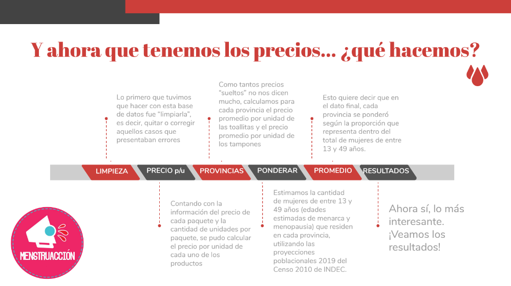

https://github.com/luisDVA/annotater

## Presentación

Luego de la exploración, organización y limpieza de los datos obtenidos por el #MenstruScrapper (en otro script), en el presente documento de trabajo se encuentra el cálculo del costo de menstruar en Argentina, estimación realizada desde la campaña #MenstruAccion y EcoFeminitas.
<br><br>
En el archivo `README` de la carpeta `Fuentes` se encuentran aclaradas todas las fuentes adicionales a las que se recurrió para realizar el cálculo.

## Preparando el entorno de trabajo

Comenzamos levantando las librerías necesarias, y cargando los datos que se encuentran en formato .RDS.

```{r echo=TRUE, message=FALSE, warning=FALSE}
library(EnvStats)
library(tidyverse)
library(ggridges)
library(openxlsx)
library(viridis)
library(readxl)
library(magrittr)
library(scales)
library(kableExtra)
library(ggrepel)
library(directlabels)
library(lubridate)
```

```{r echo=TRUE, message=FALSE, warning=FALSE}
datos <- readRDS("Fuentes/precios-gestion-menstrual-2020-03-23-limpio.RDS")

head(datos)
```

A su vez, se carga la estimación, por cada provincia, de personas que menstrúan. Como está aclarado en la carpeta de fuentes, esto sale de las proyecciones poblacionales del INDEC para 2020, teniendo en cuenta que la menarca se estima en los 13 años y la menopausia en 49 años. Estos datos se van a utilizar para ponderar el precio promedio de cada provincia a la hora de agregar en un indicador nacional. Como se encuentran en un archivo `.xls`, usamos la función `read_excel()`.

```{r echo=TRUE, message=FALSE, warning=FALSE}
menstruan <- read_excel("Fuentes/poblaciones.xls")

head(menstruan)
```

A continuación, calculamos el total a nivel nacional de personas que menstrúan, sumando los datos de todas las provincias. Y, dividiendo los datos de cada provincia por dicho total, obtenemos las proporciones que nos van a servir para ponderar los promedios de precio según el peso de cada una de las provincias.

```{r echo=TRUE, message=FALSE, warning=FALSE}
menstruan <- menstruan %>% 
  mutate(total = sum(Menstruan),
         pond = Menstruan/total) %>% 
  select(Provincia, pond)

head(menstruan)
```

Además, considerando que hay outliers (valores atípicos) en los precios unitarios, a la hora de calcular los promedios de precios provinciales se remueven "las colas" de la distribución, utilizando una media alfa podada:     

- alfa = 2.5%

   

## Cálculo y Resultados

### Total Nacional

#### Toallitas

##### Promedio del precio por unidad

Antes de calcular el promedio de los precios unitarios de las toallitas para el total nacional, calculamos el promedio de cada provincia. Para eso tomamos los datos, los filtramos para quedarnos únicamente con las toallitas, agrupando las observaciones según la variable `Provincia`. Con `summarise()` podemos definir indicadores que agregan la información para cada grupo, así que definimos el promedio provincial como una media alpha podada. 

```{r echo=TRUE, message=FALSE, warning=FALSE}
toallitas <- datos %>% 
  filter(Categoría == "toallitas") %>%
  group_by(Provincia) %>% 
  summarise(prom = mean(precio_unidad, trim = 0.025)) %>% 
  left_join(., menstruan, by = "Provincia")

head(toallitas)
```

Luego, el valor promedio para el total nacional se calcula como una media ponderada, utilizando los ponderadores previamente calculados para cada provincia. 

```{r echo=TRUE, message=FALSE, warning=FALSE}
valor_toallitas <- weighted.mean(toallitas$prom, toallitas$pond)

print(paste("Toallitas: El precio promedio por unidad es de $", round(valor_toallitas, 2)),)
```

##### Gasto por año por persona

El gasto anual por persona se calcula teniendo en cuenta:

- ciclos por año: 13
- productos utilizados por ciclo: 22

(Ambos datos se encuentran aclarados en las `Fuentes`)

```{r echo=TRUE, message=FALSE, warning=FALSE}
ciclos_por_anio <- 13
productos_por_ciclo <- 22
productos_por_anio <- ciclos_por_anio * productos_por_ciclo

gasto_por_anio_toallitas <- valor_toallitas * productos_por_anio

print(paste("Toallitas: El gasto promedio por año por persona es de $", round(gasto_por_anio_toallitas, 2)))
```

#### Tampones

##### Promedio del precio por unidad

```{r echo=TRUE, message=FALSE, warning=FALSE}
tampones <- datos %>% 
  filter(Categoría == "tampones") %>%
  group_by(Provincia) %>% 
  summarise(prom = mean(precio_unidad, trim = 0.025)) %>% 
  left_join(., menstruan, by = "Provincia")

valor_tampones <- weighted.mean(tampones$prom, tampones$pond)

print(paste("Tampones: El precio promedio por unidad es de $", round(valor_tampones, 2)))
```

##### Gasto por año por persona

El gasto anual por persona se calcula teniendo en cuenta:

- ciclos por año: 13
- productos utilizados por ciclo: 22

```{r echo=TRUE, message=FALSE, warning=FALSE}
gasto_por_anio_tampones <- valor_tampones * productos_por_anio

print(paste("Tampones: El gasto promedio por año por persona es de $", round(gasto_por_anio_tampones, 2)))
```

### Por provincia

#### Toallitas

##### Gasto por año por persona

```{r echo=TRUE, message=FALSE, warning=FALSE}
toallitas <- toallitas %>% 
  mutate(gasto_por_anio = round(prom * productos_por_anio, 2)) %>% 
  select(-prom, -pond)

toallitas
```

#### Tampones

##### Gasto por año por persona

```{r echo=TRUE, message=FALSE, warning=FALSE}
tampones <- tampones %>% 
  mutate(gasto_por_anio = round(prom * productos_por_anio, 2)) %>% 
  select(-prom, -pond)

tampones
```

### Aumentos

```{r echo=TRUE, message=FALSE, warning=FALSE}
serie_inflacion <- read_excel("Fuentes/serie_inflacion.xlsx")
precios_pgm <- read_excel("Fuentes/serie_precios_pgm.xlsx")
```

```{r echo=TRUE, message=FALSE, warning=FALSE}
base100 <- serie_inflacion %>% 
  mutate(`Nivel General` = `Nivel General`/first(`Nivel General`) * 100,
         `Alimentos y bebidas no alcohólicas` = `Alimentos y bebidas no alcohólicas`/
           first(`Alimentos y bebidas no alcohólicas`) * 100,
         Salud = Salud/first(Salud) * 100)
```

```{r echo=TRUE, message=FALSE, warning=FALSE}
pgm_100 <- precios_pgm %>% 
  mutate(Toallitas = Toallitas/first(Toallitas) * 100,
         Tampones = Tampones/first(Tampones) * 100)
```

```{r echo=TRUE, message=FALSE, warning=FALSE}
base100 <- base100 %>% 
  left_join(., pgm_100, by = "Mes") %>% 
  pivot_longer(-Mes, names_to = "Categoria", values_to = "Indice") %>% 
  filter(!is.na(Indice)) %>% 
  mutate(Grupo = case_when(Categoria %in% c("Nivel General", "Alimentos y bebidas no alcohólicas", "Salud") ~ "IPC",
                           Categoria %in% c("Toallitas", "Tampones") ~ "PGM"))
```

```{r echo=TRUE, message=FALSE, warning=FALSE}
colorcitos <- c('royalblue4', 'royalblue', 
                'violetred', 'red')
```

```{r echo=TRUE, message=FALSE, warning=FALSE}
base100bis <- base100 %>% 
  mutate(Categoria = case_when(Categoria == "Alimentos y bebidas no alcohólicas" ~ "Alimentos",
                               TRUE ~ Categoria)) %>% 
  filter(Categoria != "Alimentos")
```

```{r echo=TRUE, message=FALSE, warning=FALSE}
ggplot(base100bis, aes(x = Mes, y = Indice, group = Categoria, color = Categoria)) +
  geom_line(data = base100bis %>% filter(Grupo == "PGM"), size = 1, alpha = 1) +
  geom_line(data = base100bis %>% filter(Grupo == "IPC"), alpha = 1, size = 1) +
  geom_point(data = base100bis %>% filter(Grupo == "PGM"), size = 2) +
  theme_minimal() +
  theme(legend.position = "none") +
  scale_color_manual(values = colorcitos) +
  expand_limits(x = as.POSIXct(c("2019-03-01", "2020-05-01"))) +
  geom_text(data = base100bis %>% filter(Mes == max(Mes)), aes(label = Categoria), 
                   hjust = -0.1) +
  labs(title = "Inflación de Toallitas y Tampones vs. Salud y Nivel General del IPC-INDEC",
       subtitle = "Marzo 2019 - Marzo 2020. ",
       x = "",
       y = "Indice de precios",
       caption = "Fuente: #MenstruAcción y EcoFeminitas") +
  scale_x_datetime(date_labels = "%m-%y", date_breaks = "1 month")
```


Limites: 

- posibles sesgos de la información de la página
- copas?
- no tenemos ponderadores de consumo toallitas/tampones
- algo sobre ingresos (histograma? deciles?)
- población trans (eph y censo 2020)
- comparación IPC general, leche u otros productos


