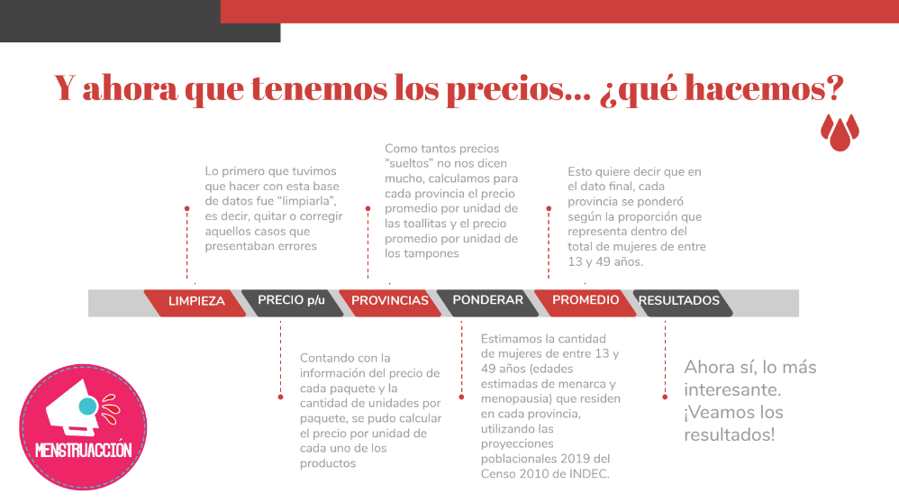

## Presentación

Luego de la exploración, organización y limpieza de los datos obtenidos por el #MenstruScrapper (en otro script), en el presente documento de trabajo se encuentra el cálculo del costo de menstruar en Argentina, estimación realizada desde la campaña #MenstruAccion y EcoFeminitas.
<br><br>
En el archivo `README` de la carpeta `Fuentes` se encuentran aclaradas todas las fuentes adicionales a las que se recurrió para realizar el cálculo.

## Preparando el entorno de trabajo

Comenzamos levantando las librerías necesarias, y cargando los datos que se encuentran en formato .RDS. Aprovechamos para tener una vista previa de los datos.

```{r echo=TRUE, message=FALSE, warning=FALSE}
library(tidyverse)
library(readxl)
library(DT)
```


```{r eval=FALSE, message=FALSE, warning=FALSE, include=FALSE}
library(EnvStats)

library(ggridges)
library(openxlsx)
library(viridis)

library(magrittr)
library(scales)
library(kableExtra)
library(ggrepel)
library(directlabels)
library(lubridate)
```

```{r echo=TRUE, message=FALSE, warning=FALSE}
datos <- readRDS("Fuentes/precios-gestion-menstrual-2020-09-06-limpio.RDS")

head(datos)
```

A su vez, se carga la estimación, por cada provincia, de personas que menstrúan. Como está aclarado en la carpeta de fuentes, esto sale de las proyecciones poblacionales del INDEC para 2020, teniendo en cuenta que la menarca se estima en los 13 años y la menopausia en 49 años. Estos datos se van a utilizar para ponderar el precio promedio de cada provincia a la hora de agregar en un indicador nacional. Como se encuentran en un archivo `.xls`, usamos la función `read_excel()`. Obtenemos también una vista previa de la estructura de estos datos.

```{r echo=TRUE, message=FALSE, warning=FALSE}
menstruan <- read_excel("Fuentes/poblaciones.xls")

head(menstruan)
```

A continuación, calculamos el total a nivel nacional de personas que menstrúan, sumando los datos de todas las provincias. Y, dividiendo los datos de cada provincia por dicho total, obtenemos las proporciones que nos van a servir para ponderar los promedios de precio según el peso de cada una de las provincias. Como guardo estas modificaciones bajo el mismo nombre, la información será pisada en la misma tabla `menstruan`, de la que se vuelve a presentar una vista previa.

```{r echo=TRUE, message=FALSE, warning=FALSE}
menstruan <- menstruan %>% 
  mutate(total = sum(Menstruan),
         pond = Menstruan/total) %>% 
  select(Provincia, pond)

head(menstruan)
```

Además, considerando que hay outliers (valores atípicos) en los precios unitarios, a la hora de calcular los promedios de precios provinciales se remueven "las colas" de la distribución, utilizando una media alfa podada:     

- alfa = 2.5%

   

## Cálculo y Resultados

A continuación ya procedemos a calcular los precios promedio de toallitas y tampones. Para el caso del total nacional, primero habrá que calcular los precios promedio (por unidad) de cada provincia, para luego agregarlos en un promedio general. Una vez que tenemos precios representativos de toallitas y tampones, podremos estimar un costo anual por persona de acuerdo a las estimaciones de cuántos ciclos por año presentan las personas que menstrúan, y cuántos productos utilizan por ciclo.

### Total Nacional

#### Toallitas

##### Promedio del precio por unidad

Para calcular el precio promedio de cada provincia tomamos los datos, los filtramos para quedarnos únicamente con las toallitas, agrupando las observaciones según la variable `Provincia`. Con `summarise()` podemos definir indicadores que agregan la información para cada grupo, así que definimos el promedio provincial como una media podada. Es en el parámetro `trim` que se aclara la proporción de los datos que se podan. Finalmente, anexamos en una nueva columna los ponderadores de cada provincia, así toda la información necesaria para el cálculo del promedio nacional se encuentra en la misma tabla.

```{r echo=TRUE, message=FALSE, warning=FALSE}
toallitas <- datos %>% 
  filter(Categoría == "toallitas") %>%
  group_by(Provincia) %>% 
  summarise(prom = mean(precio_unidad, trim = 0.025)) %>% 
  left_join(., menstruan, by = "Provincia")

head(toallitas)
```

Luego, el valor promedio para el total nacional se calcula como una media ponderada. La función `weighted.mean()` nos permite aclarar la variable a promediar, y la variable que funciona como ponderador.

```{r echo=TRUE, message=FALSE, warning=FALSE}
valor_toallitas <- weighted.mean(toallitas$prom, toallitas$pond)

print(paste("Toallitas: El precio promedio por unidad es de $", round(valor_toallitas, 2)),)
```

##### Gasto por año por persona

El gasto anual por persona se calcula teniendo en cuenta:

- ciclos por año: 13
- productos utilizados por ciclo: 22

(Ambos datos se encuentran aclarados en las `Fuentes`)

```{r echo=TRUE, message=FALSE, warning=FALSE}
ciclos_por_anio <- 13
productos_por_ciclo <- 22
productos_por_anio <- ciclos_por_anio * productos_por_ciclo

gasto_por_anio_toallitas <- valor_toallitas * productos_por_anio

print(paste("Toallitas: El gasto promedio por año por persona es de $", round(gasto_por_anio_toallitas, 2)))
```

#### Tampones

Se realiza un procedimiento semejante para el caso de los tampones.

##### Promedio del precio por unidad

```{r echo=TRUE, message=FALSE, warning=FALSE}
tampones <- datos %>% 
  filter(Categoría == "tampones") %>%
  group_by(Provincia) %>% 
  summarise(prom = mean(precio_unidad, trim = 0.025)) %>% 
  left_join(., menstruan, by = "Provincia")

valor_tampones <- weighted.mean(tampones$prom, tampones$pond)

print(paste("Tampones: El precio promedio por unidad es de $", round(valor_tampones, 2)))
```

##### Gasto por año por persona

El gasto anual por persona se calcula teniendo en cuenta:

- ciclos por año: 13
- productos utilizados por ciclo: 22

```{r echo=TRUE, message=FALSE, warning=FALSE}
gasto_por_anio_tampones <- valor_tampones * productos_por_anio

print(paste("Tampones: El gasto promedio por año por persona es de $", round(gasto_por_anio_tampones, 2)))
```

### Por provincia

Para obtener los datos de cada provincia el procedimiento es aún más sencillo. En la variable `gasto_por_anio`, cada precio promedio se multiplica por la cantidad de productos que se utilizan anualmente. Por una cuestión de exposición, se quitan de la tabla las columnas con aquellos precios promedios por unidad, y los ponderadores provinciales.

#### Toallitas

##### Gasto por año por persona

```{r echo=TRUE, message=FALSE, warning=FALSE}
toallitas <- toallitas %>% 
  mutate(gasto_por_anio = round(prom * productos_por_anio, 2)) %>% 
  select(-prom, -pond) %>% 
  arrange(gasto_por_anio)

toallitas %>%
    datatable(
    extensions = 'Buttons', 
    options = list(dom = 'Bfrtip', 
                   buttons = c('copy', 'csv', 'excel', 'pdf', 'print')))
```

#### Tampones

##### Gasto por año por persona

```{r echo=TRUE, message=FALSE, warning=FALSE}
tampones <- tampones %>% 
  mutate(gasto_por_anio = round(prom * productos_por_anio, 2)) %>% 
  select(-prom, -pond) %>% 
  arrange(gasto_por_anio)

tampones %>% 
    datatable(
    extensions = 'Buttons', 
    options = list(dom = 'Bfrtip', 
                   buttons = c('copy', 'csv', 'excel', 'pdf', 'print')))
```

ACTUALIZAR DESDE ACÁ (VER README DE FUENTES, falta actualizar serie_inflacion.xlsx)

### Aumentos

Como esta es la cuarta vez que realizamos este ejercicio de estimación semestral, podemos ver cómo evolucionaron los precios de toallitas y tampones en el último año. También, con los datos del Índice de Precios al Consumidor (IPC - INDEC), se puede realizar una comparación entre la evolución de estos productos de gestión menstrual y el nivel general de precios, el rubro alimentos y bebidas no alcohólicas, y el de Salud. Ambas series se levantan desde archivos de extensión .xlsx en las tablas `serie_inflacion` y `precios_pgm`.

```{r echo=TRUE, message=FALSE, warning=FALSE}
serie_inflacion <- read_excel("Fuentes/serie_inflacion.xlsx")
precios_pgm <- read_excel("Fuentes/serie_precios_pgm.xlsx")
```

```{r echo=TRUE, message=FALSE, warning=FALSE}
head(serie_inflacion)
```

```{r echo=TRUE, message=FALSE, warning=FALSE}
head(precios_pgm)
```

Asegurándonos de que los datos se encuentran ordenados por fecha, podemos transformar ambas series para que se encuentren expresadas con el mes de marzo 2019 = 100. De esta forma podremos comparar la evolución de ambas. Esto lo hacemos modificando las series con las que contamos dividiendo todos los valores por el primero de ellos (y multiplicando por 100). La selección del primer elemento de la serie se realizó con la función `first()`.

```{r echo=TRUE, message=FALSE, warning=FALSE}
base100 <- serie_inflacion %>% 
  mutate(`Nivel General` = `Nivel General`/first(`Nivel General`) * 100,
         `Alimentos y bebidas no alcohólicas` = `Alimentos y bebidas no alcohólicas`/
           first(`Alimentos y bebidas no alcohólicas`) * 100,
         Salud = Salud/first(Salud) * 100)

head(base100)
```

```{r echo=TRUE, message=FALSE, warning=FALSE}
pgm_100 <- precios_pgm %>% 
  mutate(Toallitas = Toallitas/first(Toallitas) * 100,
         Tampones = Tampones/first(Tampones) * 100)

head(pgm_100)
```

Podemos anexar la evolución de los precios de los productos de gestión menstrual a la serie de inflación, por más que esta última tenga valores mensuales y nuestros datos se hayan recolectado cada seis meses, utilizando `Mes` como variable de link. Luego reordenamos la información para que todas las variables, excepto `Mes`, se presenten en una variable `Categoría` (con valores "Nivel General", "Salud", "Toallitas", etc.), y los valores de cada serie se agrupen en la variable `Indice`. No habrá datos en diversos meses para toallitas y tampones, así que filtramos esas filas vacías, y finalmente creamos la variable `Grupo` para identificar como "IPC" a las categorías del índice de precios al consumidor, y como "PGM" a los productos de gestión menstrual.

```{r echo=TRUE, message=FALSE, warning=FALSE}
# Esto se puede correr "de a poco" para ver cómo cambian las cosas en cada paso
base100 <- base100 %>% 
  left_join(., pgm_100, by = "Mes") %>% 
  pivot_longer(-Mes, names_to = "Categoria", values_to = "Indice") %>% 
  filter(!is.na(Indice)) %>% 
  mutate(Grupo = case_when(Categoria %in% c("Nivel General", "Alimentos y bebidas no alcohólicas", "Salud") ~ "IPC",
                           Categoria %in% c("Toallitas", "Tampones") ~ "PGM"))

head(base100)
```

A fines de graficar esta información, por esta vez se prescinde de la serie de "Alimentos y bedidas no alcohólicas" porque no agrega tanta información en la comparabilidad, y sí ocupa espacio visual que puede obstruir la comparación de las demás series.

```{r echo=TRUE, message=FALSE, warning=FALSE}
base100bis <- base100 %>% 
  filter(Categoria != "Alimentos y bebidas no alcohólicas")
```

Para el gráfico puedo definir un vector de colores que sirva para distinguir las series de IPC (en la gama de azules) y las de productos de gestión menstrual (en la gama del rojo).

```{r echo=TRUE, message=FALSE, warning=FALSE}
colorcitos <- c('royalblue4', 'royalblue', 
                'violetred', 'red')
```

Finalmente, definimos nuestro gráfico. Tomando la tabla `base100bis`, 

```{r echo=TRUE, message=FALSE, warning=FALSE}
ggplot(base100bis, aes(x = Mes, y = Indice, group = Categoria, color = Categoria)) +
  geom_line(data = base100bis %>% filter(Grupo == "PGM"), size = 1, alpha = 1) +
  geom_line(data = base100bis %>% filter(Grupo == "IPC"), alpha = 1, size = 1) +
  geom_point(data = base100bis %>% filter(Grupo == "PGM"), size = 2) +
  theme_minimal() +
  theme(legend.position = "none") +
  scale_color_manual(values = colorcitos) +
  expand_limits(x = as.POSIXct(c("2019-03-01", "2020-05-01"))) +
  geom_text(data = base100bis %>% filter(Mes == max(Mes)), aes(label = Categoria), 
                   hjust = -0.1) +
  labs(title = "Inflación de Toallitas y Tampones vs. Salud y Nivel General del IPC-INDEC",
       subtitle = "Marzo 2019 - Marzo 2020. ",
       x = "",
       y = "Indice de precios",
       caption = "Fuente: #MenstruAcción y EcoFeminitas") +
  scale_x_datetime(date_labels = "%m-%y", date_breaks = "1 month")
```


CHEQUEAR QUE LIBRERIAS USE

Limites: 

- posibles sesgos de la información de la página
- copas?
- no tenemos ponderadores de consumo toallitas/tampones
- algo sobre ingresos (histograma? deciles?)
- población trans (eph y censo 2020)
- comparación IPC general, leche u otros productos


