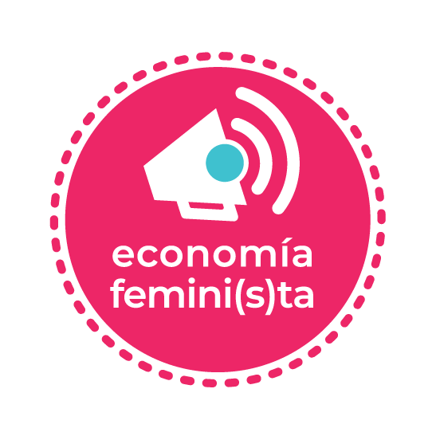

## [Informes de desigualdad de género](informe_desigualdad_genero)

En esta serie de informes se presentan indicadores sociales con el objetivo de visibilizar la desigualdad de género en la composición del mercado de trabajo, la percepción de ingresos, entre otras cuestiones, en un formato amigable. Los mismos fueron calculados con bases públicas de la EPH (Encuesta Permanente de Hogares - INDEC - Argentina). 

## [Informe: Las trabajadoras de servicio doméstico en Argentina](informe_servicio_domestico)

Se presentan diversos indicadores referidos a las condiciones de trabajo de las trabajadoras que prestan servicio doméstico en hogares particulares. La información proviene de la base usuaria de la EPH (Encuesta Permanente de Hogares - INDEC - Argentina) y refiere a los 31 aglomerados urbanos relevados por la misma.
  
Quienes estén interesados en reproducir los cálculos necesarios para obtener la información que aquí se presenta, pueden obtener la sintaxis en lenguaje R.

## [¿Cuánto cuesta menstruar?](MenstruAccion)

Tutoriales que detallan la metodología utilizada para calcular, cada semestre, el costo anual de menstruar en Argentina y la comparación con la evolución general de precios. Dirigido a quienes tengan un conocimiento básico de programación en R Software.

## [Para citar nuestro trabajo](http://doi.org/10.5281/zenodo.4540185)

Shokida Natsumi, Serpa Daiana, Domenech Laia, Moure Julieta, Fernández Erlauer Micaela, Espiñeira Lucía, & Santellán Celina. (2021). Ecofeminita/EcoFemiData: informes ecofemidata. Zenodo.  http://doi.org/10.5281/zenodo.4540185

### BibTeX Export:

      @misc{ecofemidata,
        author       = {Shokida Natsumi and
                        Serpa Daiana and
                        Domenech Laia and
                        Moure Julieta and
                        Fernández Erlauer Micaela and
                        Espiñeira Lucía and
                        Santellán Celina},
        title        = {Ecofeminita/EcoFemiData: informes ecofemidata},
        month        = feb,
        year         = 2021,
        publisher    = {Zenodo},
        doi          = {10.5281/zenodo.4540185},
        url          = {https://doi.org/10.5281/zenodo.4540185}
      }
